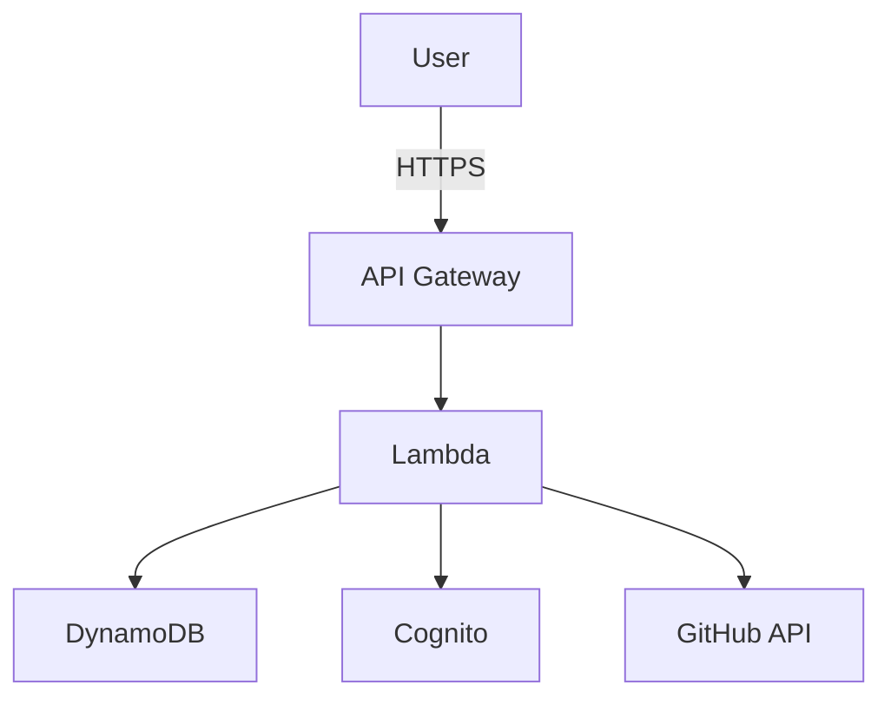

# Architecture Diagrams - DevInsights AI

Visual representation of system architecture, data flows, and multi-tenancy design.

---

## 🏗️ **1. HIGH-LEVEL SYSTEM ARCHITECTURE**
````
┌─────────────────────────────────────────────────────────────────┐
│                        CLIENT LAYER                             │
│  ┌──────────────┐  ┌──────────────┐  ┌──────────────┐         │
│  │   Browser    │  │  Mobile App  │  │  Postman/API │         │
│  │  (Future)    │  │   (Future)   │  │    Client    │         │
│  └──────┬───────┘  └──────┬───────┘  └──────┬───────┘         │
│         │                  │                  │                  │
│         └──────────────────┼──────────────────┘                  │
│                            │ HTTPS/TLS                           │
└────────────────────────────┼─────────────────────────────────────┘
                             ▼
┌─────────────────────────────────────────────────────────────────┐
│                     AWS API GATEWAY                             │
│  ┌────────────────────────────────────────────────────────┐    │
│  │  • HTTP API (REST)                                     │    │
│  │  • CORS Configuration                                  │    │
│  │  • Rate Limiting (1000 req/sec)                        │    │
│  │  • JWT Token Validation                                │    │
│  │  • Request Routing                                     │    │
│  └────────────────────────────────────────────────────────┘    │
└────────────────────────────┬────────────────────────────────────┘
                             ▼
         ┌───────────────────┴───────────────────┐
         │                                       │
         ▼                                       ▼
┌──────────────────┐                  ┌──────────────────┐
│  AUTH HANDLER    │                  │  AI HANDLER      │
│                  │                  │                  │
│  • Sign Up       │                  │  • Code Quality  │
│  • Login         │                  │  • Burnout Risk  │
│  • Verify        │                  │  • Team Perf     │
│  • Refresh       │                  │  • Dashboard     │
│                  │                  │  • Reports       │
│  Lambda Functions│                  │  Lambda Functions│
│  (Node.js 18.x)  │                  │  (Node.js 18.x)  │
└────────┬─────────┘                  └────────┬─────────┘
         │                                     │
         ├──────────────┬──────────────────────┤
         ▼              ▼                      ▼
┌─────────────┐  ┌─────────────┐    ┌──────────────────┐
│AWS COGNITO  │  │  DynamoDB   │    │ External APIs    │
│             │  │             │    │                  │
│• User Pool  │  │• Multi-     │    │• GitHub API      │
│• JWT Tokens │  │  Tenant     │    │• OpenRouter AI   │
│• Email      │  │  Storage    │    │  (Mistral)       │
│  Verify     │  │• 24h Cache  │    │                  │
│             │  │• TTL Auto-  │    │                  │
│Free: 50K    │  │  Cleanup    │    │Free: 5M tokens   │
│users/month  │  │             │    │per month         │
│             │  │Free: 25GB   │    │                  │
└─────────────┘  └─────────────┘    └──────────────────┘
         │              │                      │
         └──────────────┴──────────────────────┘
                        ▼
              ┌──────────────────┐
              │  CloudWatch      │
              │  • Logs          │
              │  • Metrics       │
              │  • Alarms        │
              │  • Dashboards    │
              └──────────────────┘
````

**Cost Summary:**
- API Gateway: FREE (1M calls/month)
- Lambda: FREE (1M requests/month)
- DynamoDB: FREE (25GB)
- Cognito: FREE (50K users)
- OpenRouter: FREE (5M tokens)
- **Total: $0/month** ✅

---

## 🔄 **2. REQUEST FLOW - CODE QUALITY ANALYSIS**
````
┌─────────┐
│  USER   │ "Analyze my GitHub code quality"
└────┬────┘
     │ GET /ai/code-quality/username
     │ Authorization: Bearer <JWT>
     ▼
┌─────────────────────────────────────────────────┐
│           1. API GATEWAY                        │
│  • Receive HTTPS request                        │
│  • Check rate limits                            │
│  • Route to Lambda                              │
└────┬────────────────────────────────────────────┘
     ▼
┌─────────────────────────────────────────────────┐
│           2. LAMBDA HANDLER                     │
│  Extract JWT → {                                │
│    userId: "user-123",                          │
│    organizationId: "org-abc",  ← KEY!           │
│    role: "member"                               │
│  }                                              │
└────┬────────────────────────────────────────────┘
     ▼
┌─────────────────────────────────────────────────┐
│           3. AUTHORIZATION CHECK                │
│  • Does user belong to org?          ✅        │
│  • Does username belong to org?      ✅        │
│  • Permission to access?              ✅        │
└────┬────────────────────────────────────────────┘
     ▼
┌─────────────────────────────────────────────────┐
│           4. CHECK CACHE (DynamoDB)             │
│  Query: {                                       │
│    PK: "ORG#org-abc",                          │
│    SK: "GITHUB_DATA#username"                  │
│  }                                              │
│                                                 │
│  Cache HIT? ───YES──→ Return cached data (50ms)│
│     │                                           │
│     NO (Cache MISS)                             │
└────┬────────────────────────────────────────────┘
     ▼
┌─────────────────────────────────────────────────┐
│           5. FETCH GITHUB DATA                  │
│                                                 │
│  ┌─────────────────────────────────────┐       │
│  │ Parallel API Calls (Fast!)          │       │
│  │                                      │       │
│  │  GET /users/{username}/repos         │       │
│  │    → Returns: 10 repositories        │       │
│  │                                      │       │
│  │  For each repo (parallel):          │       │
│  │    GET /repos/{repo}/commits         │       │
│  │    GET /repos/{repo}/pulls           │       │
│  │    GET /repos/{repo}/issues          │       │
│  └─────────────────────────────────────┘       │
│                                                 │
│  Aggregated Data:                               │
│  • Total Commits: 2,456                         │
│  • Total PRs: 156                               │
│  • Total Issues: 89                             │
│  • Languages: JS (60%), Python (30%)            │
│                                                 │
│  Time: ~200ms (parallel execution)              │
└────┬────────────────────────────────────────────┘
     ▼
┌─────────────────────────────────────────────────┐
│           6. AI ANALYSIS (OpenRouter)           │
│                                                 │
│  POST https://openrouter.ai/api/v1/chat        │
│  Model: mistral/mistral-7b-instruct             │
│                                                 │
│  Prompt:                                        │
│  "Analyze this developer's code quality:       │
│   - 2,456 commits                               │
│   - 156 PRs (avg merge: 3.2 days)              │
│   - 89 issues (avg resolve: 4.5 days)          │
│   - Languages: JavaScript (60%)                 │
│                                                 │
│   Provide:                                      │
│   1. Quality score (0-10)                       │
│   2. Detected issues                            │
│   3. Recommendations"                           │
│                                                 │
│  AI Response:                                   │
│  {                                              │
│    overallScore: 7.8,                           │
│    issues: [                                    │
│      "Large commits (>50 files): 12%",          │
│      "Limited type safety"                      │
│    ],                                           │
│    recommendations: [                           │
│      "Break down large commits",                │
│      "Add TypeScript"                           │
│    ]                                            │
│  }                                              │
│                                                 │
│  Time: ~500ms                                   │
└────┬────────────────────────────────────────────┘
     ▼
┌─────────────────────────────────────────────────┐
│           7. SAVE TO CACHE (DynamoDB)           │
│  Write: {                                       │
│    PK: "ORG#org-abc",                          │
│    SK: "GITHUB_DATA#username",                 │
│    data: {                                      │
│      codeQuality: { ... },                      │
│      metrics: { ... }                           │
│    },                                           │
│    cachedAt: 1706088000000,                     │
│    ttl: 1706174400000  ← Auto-delete in 24h    │
│  }                                              │
│                                                 │
│  Time: ~20ms                                    │
└────┬────────────────────────────────────────────┘
     ▼
┌─────────────────────────────────────────────────┐
│           8. RETURN RESPONSE                    │
│  HTTP 200 OK                                    │
│  {                                              │
│    "success": true,                             │
│    "data": {                                    │
│      "codeQuality": {                           │
│        "overallScore": 7.8,                     │
│        "analysis": "Good quality...",           │
│        "issues": [...],                         │
│        "recommendations": [...]                 │
│      },                                         │
│      "metrics": { ... }                         │
│    },                                           │
│    "cached": false,                             │
│    "generatedAt": "2025-01-24T10:30:00Z"        │
│  }                                              │
│                                                 │
│  Total Time: ~850ms (first request)             │
│  Cached Time: ~50ms (subsequent requests) ⚡     │
└─────────────────────────────────────────────────┘
````

**Performance Breakdown:**
- API Gateway: 5ms
- Lambda cold start: 50ms (first request only)
- Auth validation: 10ms
- Cache check: 15ms
- GitHub API: 200ms (parallel)
- AI analysis: 500ms
- Cache save: 20ms
- **Total: ~850ms**

**Cached Request:**
- API Gateway: 5ms
- Lambda: 5ms (warm)
- Auth: 10ms
- Cache HIT: 15ms
- **Total: ~50ms** (17x faster!)

---

## 🏢 **3. MULTI-TENANT DATA ISOLATION**
````
┌─────────────────────────────────────────────────────────────────┐
│                    DYNAMODB TABLE: organizations                │
└─────────────────────────────────────────────────────────────────┘

        ┌──────────────────────────────────────────────┐
        │        ORGANIZATION BOUNDARIES               │
        │      (Physical Data Separation)              │
        └──────────────────────────────────────────────┘

╔═══════════════════════════════════════════════════════════════╗
║  PARTITION 1: TechStartup Inc                                 ║
║  PK: "ORG#org-techstartup-123"                               ║
╠═══════════════════════════════════════════════════════════════╣
║                                                               ║
║  SK: "ORG#org-techstartup-123"                               ║
║  └─ Organization Record                                       ║
║     ├─ name: "TechStartup Inc"                               ║
║     ├─ plan: "pro"                                           ║
║     └─ members: 12                                           ║
║                                                               ║
║  SK: "ADMIN#user-sarah-001"                                  ║
║  └─ Admin User (Sarah)                                        ║
║     ├─ email: "sarah@techstartup.com"                        ║
║     ├─ role: "admin"                                         ║
║     └─ githubUsername: "sarah-em"                            ║
║                                                               ║
║  SK: "MEMBER#user-bob-002"                                   ║
║  └─ Member User (Bob)                                         ║
║     ├─ email: "bob@techstartup.com"                          ║
║     ├─ role: "member"                                        ║
║     └─ githubUsername: "bob-senior"                          ║
║                                                               ║
║  SK: "MEMBER#user-charlie-003"                               ║
║  └─ Member User (Charlie)                                     ║
║     └─ githubUsername: "charlie-junior"                      ║
║                                                               ║
║  SK: "GITHUB_DATA#bob-senior"                                ║
║  └─ Bob's Analytics Cache                                     ║
║     ├─ codeQuality: 8.5/10                                   ║
║     ├─ commits: 1,234                                        ║
║     └─ cachedAt: 1706088000000                               ║
║                                                               ║
║  SK: "GITHUB_DATA#charlie-junior"                            ║
║  └─ Charlie's Analytics Cache                                 ║
║     └─ codeQuality: 6.2/10                                   ║
║                                                               ║
║  SK: "TEAM_REPORT#2025-01-24"                                ║
║  └─ Team Performance Report                                   ║
║     └─ generatedBy: "user-sarah-001"                         ║
║                                                               ║
╚═══════════════════════════════════════════════════════════════╝

        ▼ PHYSICAL PARTITION BOUNDARY ▼
        (Different DynamoDB partition)

╔═══════════════════════════════════════════════════════════════╗
║  PARTITION 2: CompetitorCorp                                  ║
║  PK: "ORG#org-competitor-789"                                ║
╠═══════════════════════════════════════════════════════════════╣
║                                                               ║
║  SK: "ORG#org-competitor-789"                                ║
║  └─ Organization Record                                       ║
║                                                               ║
║  SK: "ADMIN#user-eve-999"                                    ║
║  └─ Admin User (Eve)                                          ║
║                                                               ║
║  SK: "MEMBER#user-frank-888"                                 ║
║  └─ Member User (Frank)                                       ║
║                                                               ║
║  SK: "GITHUB_DATA#frank-dev"                                 ║
║  └─ Frank's Analytics                                         ║
║                                                               ║
╚═══════════════════════════════════════════════════════════════╝

        ▼ PHYSICAL PARTITION BOUNDARY ▼

╔═══════════════════════════════════════════════════════════════╗
║  PARTITION 3: Google Inc                                      ║
║  PK: "ORG#org-google-456"                                    ║
╠═══════════════════════════════════════════════════════════════╣
║                                                               ║
║  SK: "ORG#org-google-456"                                    ║
║  SK: "ADMIN#user-alice-111"                                  ║
║  SK: "MEMBER#user-john-222"                                  ║
║  ... (100+ engineers)                                         ║
║                                                               ║
╚═══════════════════════════════════════════════════════════════╝
````

**Query Examples:**
````
┌─────────────────────────────────────────────────────────────┐
│  QUERY 1: Sarah wants all team members                     │
├─────────────────────────────────────────────────────────────┤
│                                                             │
│  Sarah's Token:                                             │
│  └─ organizationId: "org-techstartup-123"                  │
│                                                             │
│  Query:                                                     │
│  {                                                          │
│    PK: "ORG#org-techstartup-123",  ← Automatic scoping!    │
│    SK: begins_with("MEMBER#")                              │
│  }                                                          │
│                                                             │
│  Returns:                                                   │
│  ✅ user-bob-002 (TechStartup member)                      │
│  ✅ user-charlie-003 (TechStartup member)                  │
│  ✅ ... (all TechStartup members)                          │
│                                                             │
│  Does NOT return:                                           │
│  ❌ user-eve-999 (CompetitorCorp - different partition!)   │
│  ❌ user-frank-888 (CompetitorCorp - different partition!) │
│                                                             │
└─────────────────────────────────────────────────────────────┘

┌─────────────────────────────────────────────────────────────┐
│  QUERY 2: Eve (competitor) tries to access Bob's data      │
├─────────────────────────────────────────────────────────────┤
│                                                             │
│  Eve's Token:                                               │
│  └─ organizationId: "org-competitor-789"                   │
│                                                             │
│  Eve's Query:                                               │
│  {                                                          │
│    PK: "ORG#org-competitor-789",  ← Her org only!          │
│    SK: "GITHUB_DATA#bob-senior"                            │
│  }                                                          │
│                                                             │
│  Returns: EMPTY ❌                                          │
│                                                             │
│  Why?                                                       │
│  Bob's data is in PK: "ORG#org-techstartup-123"           │
│  Eve's query looks in PK: "ORG#org-competitor-789"        │
│  → DIFFERENT PARTITIONS!                                    │
│  → IMPOSSIBLE to access cross-org! 🔒                      │
│                                                             │
└─────────────────────────────────────────────────────────────┘
````

**Security Benefits:**
````
✅ Physical Separation: Different DynamoDB partitions
✅ Automatic Scoping: JWT token enforces organization boundary
✅ Query-Level Isolation: Queries cannot cross partitions
✅ No Code Changes: Security built into data model
✅ Performance: Each org scales independently
````

---

## 🔐 **4. AUTHENTICATION & AUTHORIZATION FLOW**
````
┌───────────────────────────────────────────────────────────────┐
│                     AUTHENTICATION FLOW                       │
└───────────────────────────────────────────────────────────────┘

STEP 1: USER SIGN-UP
───────────────────────────────────────────────────────────────
┌─────────┐
│  USER   │ POST /auth/signup
└────┬────┘ { email, password, name, organizationName }
     ▼
┌─────────────────────┐
│   Lambda Handler    │
│  • Validate input   │
│  • Check duplicates │
└────┬────────────────┘
     ▼
     ├────────────────────────────────┐
     ▼                                ▼
┌─────────────┐              ┌──────────────┐
│  Cognito    │              │  DynamoDB    │
│  Create:    │              │  Create:     │
│  • User     │              │  • Org       │
│  • Password │              │  • User      │
│    (hashed) │              │  • Link      │
│  • Custom:  │              └──────────────┘
│    orgId    │
│    role     │
│  Send:      │
│  • Email    │
└─────────────┘

STEP 2: EMAIL VERIFICATION
───────────────────────────────────────────────────────────────
📧 User receives email
   ↓
User clicks verification link
   ↓
GET /auth/verify?code=ABC123
   ↓
Cognito marks user as verified ✅

STEP 3: USER LOGIN
───────────────────────────────────────────────────────────────
┌─────────┐
│  USER   │ POST /auth/login
└────┬────┘ { email, password }
     ▼
┌─────────────────────┐
│  Lambda Handler     │
└────┬────────────────┘
     ▼
┌─────────────────────┐
│  Cognito            │
│  Validate password  │
│  ↓                  │
│  Generate JWT Token │
│  ↓                  │
│  Token contains:    │
│  {                  │
│    sub: "user-123", │
│    email: "...",    │
│    organizationId:  │
│      "org-abc",     │← KEY FOR MULTI-TENANCY!
│    role: "member",  │
│    permissions: []  │
│  }                  │
│  ↓                  │
│  Return to user ✅  │
└─────────────────────┘

STEP 4: PROTECTED API REQUEST
───────────────────────────────────────────────────────────────
┌─────────┐
│  USER   │ GET /ai/code-quality/username
└────┬────┘ Authorization: Bearer <JWT_TOKEN>
     ▼
┌─────────────────────────────────────────────────────────────┐
│              API GATEWAY                                    │
│  ┌────────────────────────────────────────────────┐        │
│  │  JWT Validation:                               │        │
│  │  1. Check signature (from Cognito)         ✅  │        │
│  │  2. Check expiration                       ✅  │        │
│  │  3. Verify issuer                          ✅  │        │
│  │  4. Extract claims                         ✅  │        │
│  └────────────────────────────────────────────────┘        │
└────┬────────────────────────────────────────────────────────┘
     ▼
┌─────────────────────────────────────────────────────────────┐
│              Lambda Handler                                 │
│  ┌────────────────────────────────────────────────┐        │
│  │  Authorization Check:                          │        │
│  │                                                │        │
│  │  From Token:                                   │        │
│  │  • organizationId: "org-abc"                   │        │
│  │  • userId: "user-123"                          │        │
│  │  • role: "member"                              │        │
│  │                                                │        │
│  │  Check 1: Does username belong to org-abc?    │        │
│  │  └─ Query DynamoDB for username                │        │
│  │     Result: YES, found in org-abc          ✅  │        │
│  │                                                │        │
│  │  Check 2: Does user have permission?          │        │
│  │  └─ Role "member" can read own data       ✅  │        │
│  │                                                │        │
│  │  Authorization: GRANTED ✅                     │        │
│  └────────────────────────────────────────────────┘        │
└────┬────────────────────────────────────────────────────────┘
     ▼
   Process request with organizationId filter
   (All queries automatically scoped to org-abc)
````

**Token Lifecycle:**
````
┌─────────────────────────────────────────────────────────────┐
│  TIME: 0 hours                                              │
│  User logs in → Token issued                                │
│  Expiration: +1 hour                                        │
└─────────────────────────────────────────────────────────────┘
                          │
                          ▼
┌─────────────────────────────────────────────────────────────┐
│  TIME: 0-59 minutes                                         │
│  Token valid → All API calls work ✅                        │
└─────────────────────────────────────────────────────────────┘
                          │
                          ▼
┌─────────────────────────────────────────────────────────────┐
│  TIME: 60 minutes (expiration)                              │
│  Token expired → API calls rejected ❌                      │
│  Error: "Token expired"                                     │
└─────────────────────────────────────────────────────────────┘
                          │
                          ▼
┌─────────────────────────────────────────────────────────────┐
│  REFRESH TOKEN FLOW                                         │
│  POST /auth/refresh                                         │
│  { refreshToken: "..." }                                    │
│  ↓                                                          │
│  Cognito validates refresh token                            │
│  ↓                                                          │
│  Issues NEW access token (valid +1 hour) ✅                │
│  ↓                                                          │
│  User continues using API                                   │
└─────────────────────────────────────────────────────────────┘
````

---

## 📊 **5. TEAM PERFORMANCE DASHBOARD FLOW**
````
┌─────────────────────────────────────────────────────────────┐
│  ADMIN REQUESTS TEAM DASHBOARD                              │
│  GET /ai/team-performance/org-techstartup-123               │
└─────────────────────────────────────────────────────────────┘
                          ▼
┌─────────────────────────────────────────────────────────────┐
│  STEP 1: Get All Team Members                               │
│  Query DynamoDB:                                            │
│  PK: "ORG#org-techstartup-123"                             │
│  SK: begins_with("MEMBER#")                                 │
│  ↓                                                          │
│  Returns 10 members:                                        │
│  [bob, charlie, alice, dave, ...]                           │
└────┬────────────────────────────────────────────────────────┘
     ▼
┌─────────────────────────────────────────────────────────────┐
│  STEP 2: Get GitHub Data for Each Member (Parallel!)       │
│                                                             │
│  ┌────────────┐  ┌────────────┐  ┌────────────┐           │
│  │  Bob's     │  │ Charlie's  │  │  Alice's   │  ...      │
│  │  Data      │  │  Data      │  │  Data      │           │
│  └────────────┘  └────────────┘  └────────────┘           │
│       │               │               │                     │
│       ▼               ▼               ▼                     │
│  Code: 8.5       Code: 6.2       Code: 7.9                 │
│  Commits: 1234   Commits: 456    Commits: 890              │
│  Burnout: 4.2    Burnout: 5.1    Burnout: 8.1 ⚠️          │
│                                                             │
│  Time: ~100ms (parallel DynamoDB queries)                   │
└────┬────────────────────────────────────────────────────────┘
     ▼
┌─────────────────────────────────────────────────────────────┐
│  STEP 3: Aggregate Team Metrics                             │
│                                                             │
│  {                                                          │
│    totalMembers: 10,                                        │
│    averageCodeQuality: 7.4,                                 │
│    totalCommits: 8234,                                      │
│    topPerformer: {                                          │
│      name: "Bob",                                           │
│      score: 8.5                                             │
│    },                                                       │
│    burnoutRisks: [                                          │
│      { name: "Alice", risk: 8.1 } ⚠️                       │
│    ]                                                        │
│  }                                                          │
└────┬────────────────────────────────────────────────────────┘
     ▼
┌─────────────────────────────────────────────────────────────┐
│  STEP 4: Send to AI for Team Analysis                       │
│                                                             │
│  OpenRouter API:                                            │
│  "Analyze this 10-person engineering team:                  │
│   • Average code quality: 7.4                               │
│   • 1 developer at high burnout risk                        │
│   • Top performer: Bob (8.5)                                │
│   • Needs support: Charlie (6.2)                            │
│                                                             │
│   Provide:                                                  │
│   1. Overall team health                                    │
│   2. Hiring recommendations                                 │
│   3. Action items"                                          │
│                                                             │
│  ↓                                                          │
│  AI Response:                                               │
│  {                                                          │
│    teamHealth: "GOOD with concerns",                        │
│    recommendations: [                                       │
│      "Address Alice's burnout immediately",                 │
│      "Mentor Charlie with senior dev",                      │
│      "Team at 85% capacity - hire 2 engineers"              │
│    ]                                                        │
│  }                                                          │
└────┬────────────────────────────────────────────────────────┘
     ▼
┌─────────────────────────────────────────────────────────────┐
│  STEP 5: Cache Team Report                                  │
│  DynamoDB Write:                                            │
│  {                                                          │
│    PK: "ORG#org-techstartup-123",                          │
│    SK: "TEAM_REPORT#2025-01-24",                           │
│    data: { ... full report ... },                           │
│    generatedBy: "user-sarah-001",                           │
│    ttl: 1706174400000  ← Expires in 24h                    │
│  }                                                          │
└────┬────────────────────────────────────────────────────────┘
     ▼
┌─────────────────────────────────────────────────────────────┐
│  STEP 6: Return Dashboard to Admin                          │
│  ┌───────────────────────────────────────────────────────┐ │
│  │  Team Performance Dashboard                           │ │
│  │  ───────────────────────────────────────────────────  │ │
│  │  Team Health: 7.2/10 (GOOD)                          │ │
│  │  Team Size: 10 engineers                             │ │
│  │                                                       │ │
│  │  🏆 Top Performer: Bob (8.5)                         │ │
│  │  ⚠️  Needs Support: Charlie (6.2)                    │ │
│  │  🚨 Burnout Risk: Alice (8.1)                        │ │
│  │                                                       │ │
│  │  💡 Recommendations:                                 │ │
│  │  • Address burnout urgently                          │ │
│  │  • Hire 2 backend engineers                          │ │
│  │  • Implement mentoring program                       │ │
│  └───────────────────────────────────────────────────────┘ │
└─────────────────────────────────────────────────────────────┘
````

---

## 🚀 **6. SCALABILITY ARCHITECTURE**
````
┌─────────────────────────────────────────────────────────────┐
│                  SCALABILITY PATTERNS                       │
└─────────────────────────────────────────────────────────────┘

LOW TRAFFIC (100 users, 1K requests/day)
───────────────────────────────────────────────────────────────
┌────────────┐
│ API Gateway│ → 1K requests/day
└──────┬─────┘
       ▼
┌──────────────┐
│ Lambda Pool  │ → 1-5 concurrent functions
└──────┬───────┘
       ▼
┌──────────────┐
│  DynamoDB    │ → 10MB data, instant queries
└──────────────┘

Cost: $0 (Free Tier) ✅

MEDIUM TRAFFIC (1K users, 100K requests/day)
───────────────────────────────────────────────────────────────
┌────────────┐
│ API Gateway│ → 100K requests/day (still free!)
└──────┬─────┘
       ▼
┌──────────────────────────────────────────────────┐
│ Lambda Pool (Auto-Scaling)                       │
│ ┌────┐ ┌────┐ ┌────┐ ┌────┐ ┌────┐             │
│ │ λ  │ │ λ  │ │ λ  │ │ λ  │ │ λ  │  ...        │
│ └────┘ └────┘ └────┘ └────┘ └────┘             │
│ 50-100 concurrent functions                      │
└──────┬───────────────────────────────────────────┘
       ▼
┌──────────────┐
│  DynamoDB    │ → 1GB data, on-demand scaling
└──────────────┘

Cost: ~$5/month (mostly OpenRouter) ✅

HIGH TRAFFIC (10K users, 1M requests/day)
───────────────────────────────────────────────────────────────
┌────────────┐
│ API Gateway│ → 1M requests/day
└──────┬─────┘
       ▼
┌──────────────────────────────────────────────────┐
│ Lambda Pool (Auto-Scaling)                       │
│ ┌────┐ ┌────┐ ┌────┐ ┌────┐                     │
│ │ λ  │ │ λ  │ │ λ  │ │ λ  │  ...                │
│ └────┘ └────┘ └────┘ └────┘                     │
│ ... 1000+ concurrent functions                   │
│ (AWS auto-creates as needed!)                    │
└──────┬───────────────────────────────────────────┘
       ▼
┌────────────────────────────────────────┐
│  DynamoDB (Auto-Scaling)               │
│  ┌──────────┐  ┌──────────┐           │
│  │Partition1│  │Partition2│  ...      │
│  │(Org A)   │  │(Org B)   │           │
│  └──────────┘  └──────────┘           │
│  → 25GB data, distributed              │
└────────────────────────────────────────┘

Cost: ~$50/month (still cheap!) ✅

ENTERPRISE TRAFFIC (100K users, 10M requests/day)
───────────────────────────────────────────────────────────────
┌────────────┐
│ API Gateway│ → 10M requests/day
└──────┬─────┘
       ▼
┌──────────────────────────────────────────────────┐
│ Lambda Pool (Massive Auto-Scaling)               │
│ ┌────┐ ┌────┐ ┌────┐                            │
│ │ λ  │ │ λ  │ │ λ  │  ...                       │
│ └────┘ └────┘ └────┘                            │
│ ... 10,000+ concurrent functions                 │
│ Distributed across multiple AZs                  │
└──────┬───────────────────────────────────────────┘
       ▼
┌────────────────────────────────────────┐
│  DynamoDB (Multi-Region?)              │
│  ┌──────────┐  ┌──────────┐           │
│  │ Region 1 │  │ Region 2 │           │
│  │(US East) │  │(US West) │           │
│  └──────────┘  └──────────┘           │
│  → 250GB data, global distribution     │
└────────────────────────────────────────┘
       ▼
┌────────────────────────────────────────┐
│  CloudWatch (Monitoring)               │
│  • Real-time metrics                   │
│  • Auto-scaling triggers               │
│  • Performance dashboards              │
└────────────────────────────────────────┘

Cost: ~$500/month
(But at this scale, you have 1000+ paying customers!)
````

**Key Scalability Features:**
````
✅ Automatic Scaling:
   • Lambda: 0 → 10,000+ functions
   • DynamoDB: On-demand capacity
   • API Gateway: Unlimited requests

✅ No Capacity Planning:
   • AWS handles all scaling
   • No need to predict traffic
   • Scales down to zero when idle

✅ Cost Efficiency:
   • Pay only for what you use
   • No idle capacity charges
   • Free tier covers initial growth

✅ Geographic Distribution:
   • Multi-region DynamoDB
   • CloudFront for global CDN
   • Low latency worldwide
````

---

## 💰 **7. COST BREAKDOWN VISUAL**
````
┌─────────────────────────────────────────────────────────────┐
│              AWS FREE TIER BREAKDOWN                        │
└─────────────────────────────────────────────────────────────┘

SERVICE: AWS Lambda
───────────────────────────────────────────────────────────────
Free Tier: 1,000,000 requests/month

Your Usage at Different Scales:

  Startup (100 users):
  │■□□□□□□□□□│ 10,000 requests/month (1% of free tier)
  Cost: $0

  Growth (1K users):
  │■■■■■■■□□□│ 100,000 requests/month (10% of free tier)
  Cost: $0

  Scale (10K users):
  │■■■■■■■■■■│ 1,000,000 requests/month (100% of free tier)
  Cost: $0

  Enterprise (100K users):
  │■■■■■■■■■■│■■■■■■■■■■│ 10,000,000 requests/month
  Cost: $2.00/month (overage)

───────────────────────────────────────────────────────────────

SERVICE: DynamoDB
───────────────────────────────────────────────────────────────
Free Tier: 25 GB storage + 2.5M read/write requests/month

Your Usage:

  Startup:
  │■□□□□□□□□□│ 10 MB (0.04% of free tier)
  Cost: $0

  Growth:
  │■■□□□□□□□□│ 500 MB (2% of free tier)
  Cost: $0

  Scale:
  │■■■■■□□□□□│ 5 GB (20% of free tier)
  Cost: $0

  Enterprise:
  │■■■■■■■■■■│■■□□□□□□□□│ 30 GB
  Cost: $1.25/month (5GB overage)

───────────────────────────────────────────────────────────────

SERVICE: API Gateway
───────────────────────────────────────────────────────────────
Free Tier: 1,000,000 requests/month

(Same usage as Lambda)

Cost: $0 - $3.50/month at scale

───────────────────────────────────────────────────────────────

SERVICE: Cognito
───────────────────────────────────────────────────────────────
Free Tier: 50,000 users/month

Your Usage:

  Startup:
  │■□□□□□□□□□│ 100 users (0.2%)
  Cost: $0

  Enterprise:
  │■■■■■■■■■■│ 50,000 users (100%)
  Cost: $0

  Beyond:
  │■■■■■■■■■■│■■□□□□□□□□│ 100,000 users
  Cost: $275/month ($0.0055 per user over 50K)

───────────────────────────────────────────────────────────────

SERVICE: OpenRouter AI
───────────────────────────────────────────────────────────────
Free Tier: 5,000,000 tokens/month

Your Usage:

  Startup:
  │■■□□□□□□□□│ 100K tokens (2%)
  Cost: $0

  Growth:
  │■■■■■■■■□□│ 2M tokens (40%)
  Cost: $0

  Scale:
  │■■■■■■■■■■│ 5M tokens (100%)
  Cost: $0

  Enterprise:
  │■■■■■■■■■■│■■■□□□□□□□│ 15M tokens
  Cost: $2.00/month (overage)

───────────────────────────────────────────────────────────────

TOTAL MONTHLY COST PROJECTION
───────────────────────────────────────────────────────────────

┌───────────┬─────────┬─────────┬─────────┬──────────┐
│ Scale     │ Users   │Requests │ Storage │   Cost   │
├───────────┼─────────┼─────────┼─────────┼──────────┤
│ Startup   │    100  │   10K   │  10 MB  │   $0     │
│ Growth    │   1,000 │  100K   │ 500 MB  │   $0     │
│ Scale     │  10,000 │   1M    │   5 GB  │   $0     │
│ Big       │ 100,000 │  10M    │  30 GB  │ $280/mo  │
│ Enterprise│ 1M      │ 100M    │ 250 GB  │ $3,500/mo│
└───────────┴─────────┴─────────┴─────────┴──────────┘

At Enterprise scale:
Revenue: $1M users × $10/month = $10M/month
Cost: $3,500/month
Margin: 99.97% 🚀
````

---

## 🛠️ **8. TOOLS TO CREATE PROFESSIONAL DIAGRAMS**

### Option 1: Draw.io (FREE, Recommended)
````
1. Visit: https://app.diagrams.net/
2. Create new diagram
3. Use AWS Icons:
   - More Shapes → AWS → AWS 19
   - Drag icons: Lambda, DynamoDB, API Gateway
4. Export as PNG/SVG
5. Add to docs/diagrams/
````

### Option 2: Lucidchart (FREE with limitations)
````
1. Visit: https://www.lucidchart.com/
2. Use AWS architecture templates
3. Professional-looking diagrams
4. Export as PNG
````

### Option 3: Excalidraw (FREE, Hand-drawn style)
````
1. Visit: https://excalidraw.com/
2. Hand-drawn aesthetic
3. Modern look
4. Export as PNG
````

### Option 4: Mermaid (Code-based, FREE)
````markdown

````

(GitHub renders this automatically!)

---

## 📸 **DIAGRAM CHECKLIST**

Create these diagrams:
````
✅ 1. High-Level Architecture (system overview)
✅ 2. Request Flow (API call lifecycle)
✅ 3. Multi-Tenant Data Model (DynamoDB structure)
✅ 4. Authentication Flow (login process)
✅ 5. Team Dashboard Flow (aggregation)
✅ 6. Scalability Pattern (growth stages)
✅ 7. Cost Breakdown (visual budget)
````

**Save in:**
- `docs/diagrams/architecture.png`
- `docs/diagrams/request-flow.png`
- `docs/diagrams/multi-tenant.png`
- etc.

**Reference in README:**
````markdown
## Architecture


See [complete diagrams](./docs/ARCHITECTURE_DIAGRAMS.md) for detailed flows.
````

---
